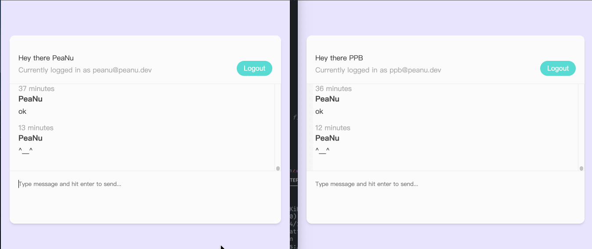

# Vue-Live-Chat

來自 [Build Web Apps with Vue JS 3 & Firebase](https://www.udemy.com/course/build-web-apps-with-vuejs-firebase/) 的其中一項專案。主要拿來練習 Vue 的基礎應用。

網站連結：https://vue-live-chat-1ee9d.web.app/chatroom

## 網站介紹

- 登入
- 註冊
- 即時線上聊天



## 使用技術

- Vue3 (CLI)
- Vue-router
- TypeScript
- Composition API
- Composables（類似 custom hook）
- Firebase authentication
- Firebase firestore

算是蠻有趣的一份專案，也順便導入了 TypeScript 來開發，得到了蠻多收穫！

## 運行方式

此專案使用 Firebase 作為資料庫，所以請先自行跑完相關申請流程。

1\. 把專案 clone 下來後安裝依賴項目：

```bash
npm install
```

2\. 建立 `./src/firebase/config.js` 檔案，並填入你的 Firebase 資訊：

```js
import firebase from 'firebase/app'
import 'firebase/firestore'
import 'firebase/auth'

const firebaseConfig = {
  apiKey: '...',
  authDomain: '...',
  projectId: '...',
  storageBucket: '...',
  messagingSenderId: '...',
  appId: '...'
}

firebase.initializeApp(firebaseConfig)

const db = firebase.firestore()
const auth = firebase.auth()
const timestamp = firebase.firestore.Timestamp

export { db, auth, timestamp }
```

3\. 啟動開發環境

```bash
npm run start
```

## 打包

```bash
npm run build
```

之後再透過 live-sever 的方式打開 `/dist/index.html` 即可
